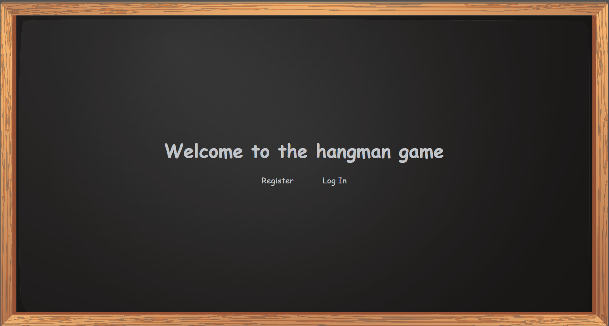
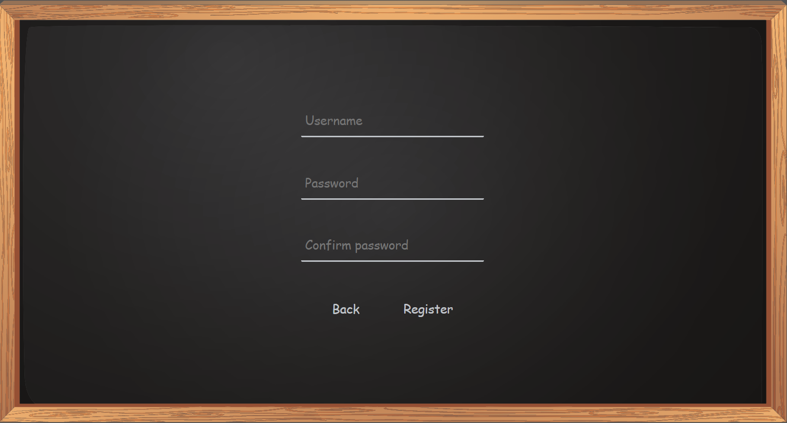
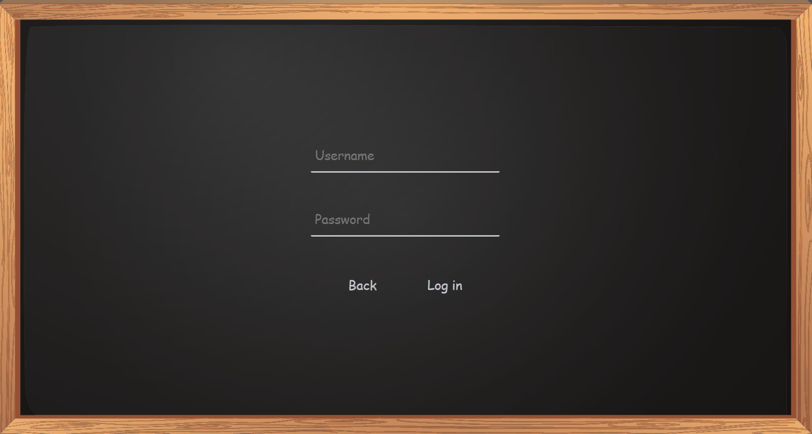
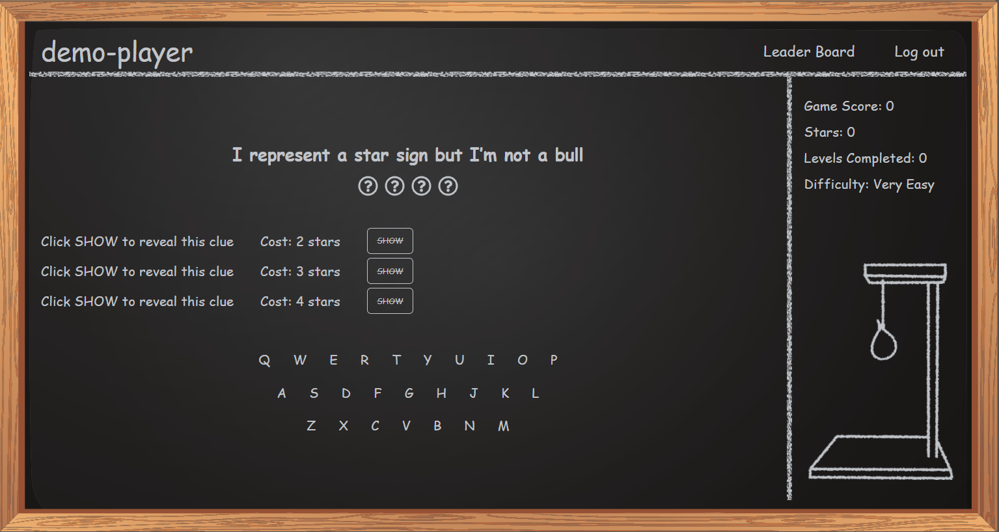
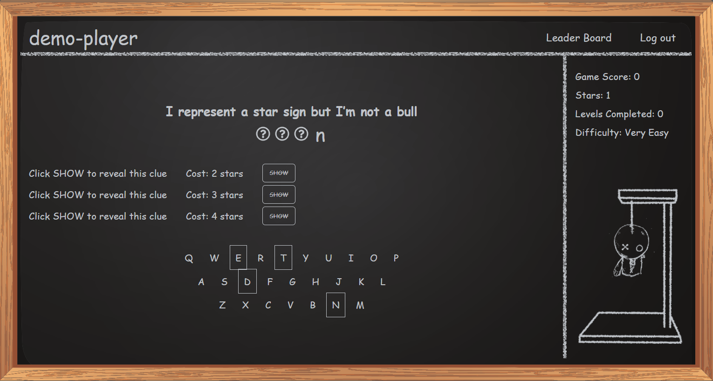
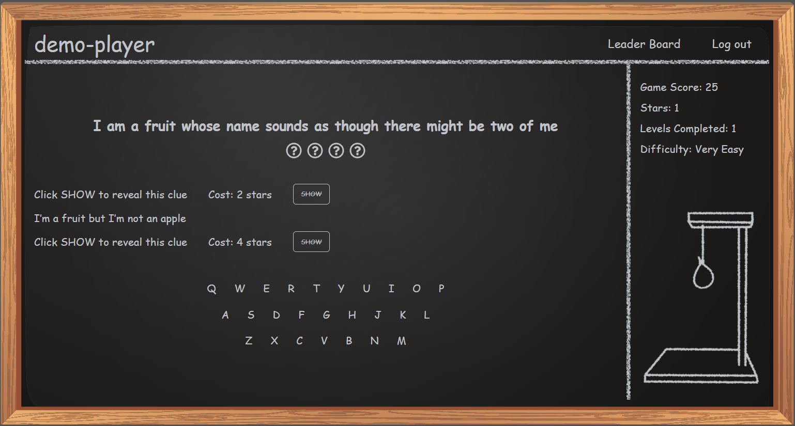
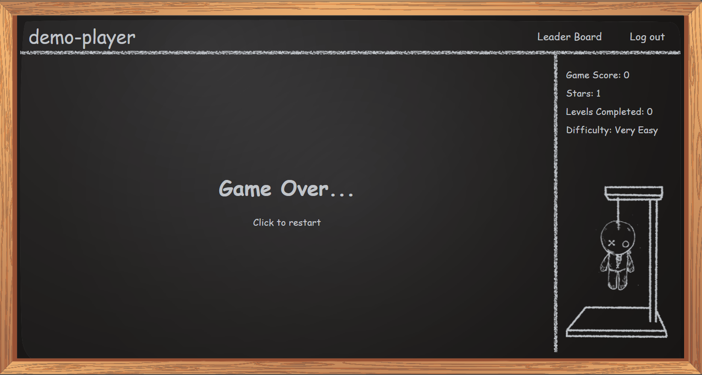
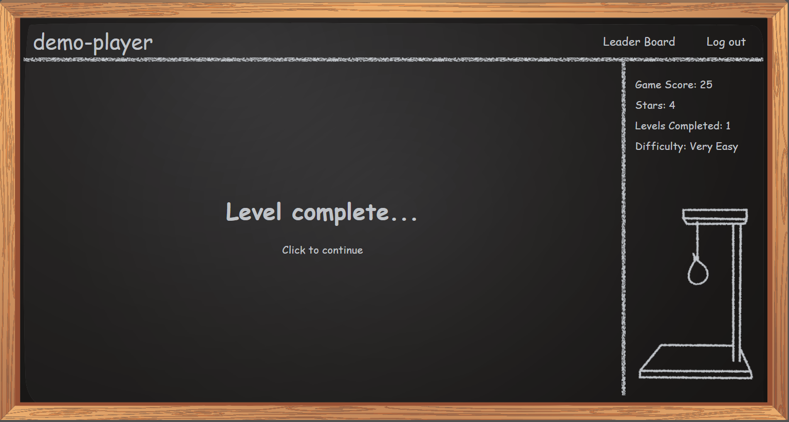
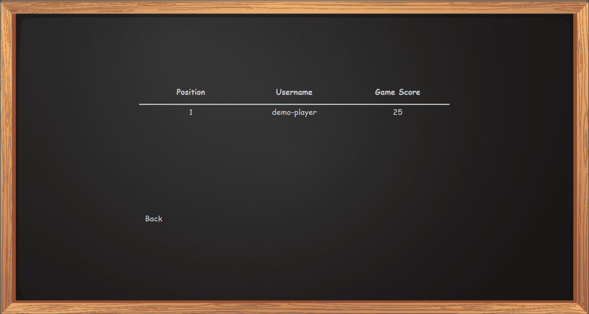

# Hangman
Web implementation of classic Hangman Game.

## Used Technologies:
- ASP 5 Web API 
- Entity Framework Core
- React
- SQL Server
- Valila CSS

## How it works:
First thing you Player will see is the home page.

 

 

Then he can create a new profile or login to the existent one. This is needed to save player progress and place him/her on the leader board.

 

 

After successfull registration or log in to existent account player will be taken to the main game area where
player is presented with the main clue and the word underneath that needs to be guessed, hints and keyboard on the main area.
Side bar contains player stats with current difficulty level and hangman frame.

 

 

 If player guesses are incorrect, hangman image will start to appear on the right side and used keys on the keyboard will be marked and dissabled.

 

 

Player has a chance to reveal hint about the secret word, but each hint have its price in stars. Price depends on the level difficulty.
If player has not enough stars, hint show button will be dissabled and will be reanabled after player collects enough stars.
Stars are gained with each correct guess.

 

 

If player failed to complete the level GAME OVER message will be displayed, and option to play again.
Previous progress will remain, but new level will be presented to the player.

 

 

If player completes level, LEVEL COMPLETE message will be displayed.
Player will be awarded with game score which depends on level difficulty and level will be added to complete level list.
He/she will be presented with new same difficulty level and hangman image will reset.
If all same difficulty levels has been completed, higher difficulty level will be shown.

 

 

Player can see leaderboard with possition, username and game score of each player

 

